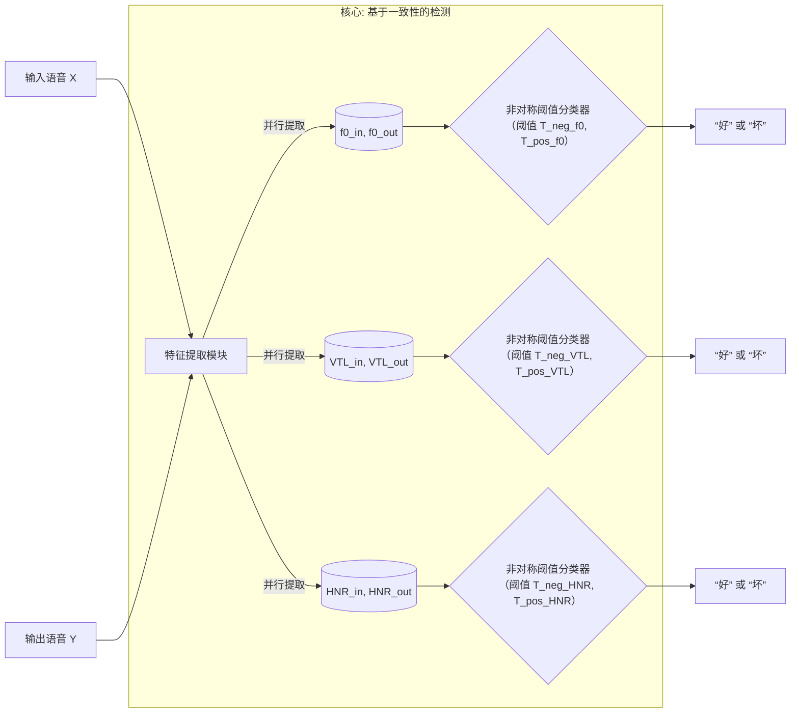

# 📄 Low-Cost Detection of Degraded Voice Clones via Source-Output Acoustic Consistency

#语音伪造检测 #语音质量评估 #信号处理 #医疗音频

🔥 **88/10** | #语音伪造检测 #语音质量评估 | [arxiv](https://arxiv.org/abs/2605.08165v1)

### 👥 作者与机构

- 第一作者：Jana Shokr
- 通讯作者：论文中未明确说明通讯作者
- 作者列表：Jana Shokr, Minos Papadopoulos, Jeremy Cooperstock, Pavo Orepic（论文中未提及任何作者机构信息）

### 💡 毒舌点评

这篇论文精准地瞄准了临床AVATAR疗法中一个真实且关键的痛点：需要快速剔除明显劣质的合成语音以保护治疗沉浸感，并提出了一个逻辑自洽、物理可解释的检测框架。然而，其核心短板在于实验的“小作坊”规模（总共仅94个样本）和与时代脱节的评估方式——在学习型方法层出不穷的今天，仅用两个简单特征和阈值与“人类标签”对比，缺乏与任何现有语音质量评估或伪造检测模型的基准较量，说服力大打折扣。

### 📌 核心摘要

本文针对临床语音治疗（如AVATAR疗法）中需要快速、自动检测明显劣质的声音克隆输出这一实际问题，提出了一种低成本的检测方法。核心方法是基于语音生成的源-滤波器模型，检验合成输出与输入声源在几个低维、可解释的声学特征上的一致性，具体使用了基频（f0）、谐波噪声比（HNR）和声道长度（VTL）。研究者在人类标注的、由两种不同声码器（WaveRNN和HiFi-GAN）生成的合成语音样本上，采用了一种非对称阈值分类方法进行评估。实验结果显示，在WaveRNN上，f0和HNR均达到85.2%的准确率；在HiFi-GAN上，HNR达到80.0%的准确率，f0为77.5%。分析表明，f0和HNR能捕获部分不同的失效模式，具有互补性。该研究的实际意义在于为高风险应用场景提供了一种快速、可解释的第一道过滤器，以提升系统的可靠性。主要局限性包括数据集规模较小、特征集有限，且未与更复杂的自动化质量预测模型进行直接对比。

| 特征 | 声码器 | 负阈值 | 正阈值 | 准确率(%) | 敏感性(%) | 特异性(%) | TP | TN | FP | FN |
| :--- | :--- | :--- | :--- | :--- | :--- | :--- | :--- | :--- | :--- | :--- |
| f0 | WaveRNN | -11.2 | 32.6 | 85.2 | 82.0 | 89.0 | 22 | 24 | 3 | 5 |
| HNR | WaveRNN | -1.7 | 1.2 | 85.2 | 82.0 | 89.0 | 22 | 24 | 3 | 5 |
| VTL | WaveRNN | -1.4 | 10.7 | 64.8 | 60.0 | 70.0 | 16 | 19 | 8 | 11 |
| f0 | HiFi-GAN | -19.3 | 50.1 | 77.5 | 60.0 | 95.0 | 12 | 19 | 1 | 8 |
| HNR | HiFi-GAN | -0.9 | 3.4 | 80.0 | 90.0 | 70.0 | 18 | 14 | 6 | 2 |
| VTL | HiFi-GAN | -1.0 | 8.7 | 67.5 | 65.0 | 70.0 | 13 | 14 | 6 | 7 |

图1展示了f0, HNR, VTL三个特征在输入-输出空间中的分布。图中清晰显示，标记为“Good”的样本（蓝色）紧密围绕在恒等线（y=x）周围，而“Bad”样本（橙色）则更多地分布在优化后的阈值带之外，直观地证明了所选特征区分好坏样本的能力。

图2展示了基于f0和HNR的分类器在样本级别上的决策一致性与分歧。对于WaveRNN，分歧大致对称，表明两个特征捕获了不同的失效子集；对于HiFi-GAN，分歧不对称，HNR拒绝了更多f0接受的样本，体现了其更高的敏感性。

图3展示了两个具有代表性的WaveRNN失效模式的声谱图，直观说明了f0和HNR检测的互补性：上排样本因严重音高偏移被f0拒绝但HNR接受；下排样本音高基本保留但谐波清晰度下降，被HNR拒绝但f0接受。

### 🔗 开源详情

- 代码：论文中未提及代码链接。论文描述了使用Python开发特征提取流程，并明确使用了开源的Parselmouth库，但未提供论文自身实现代码的仓库链接。
- 模型权重：论文中未提及模型权重链接。
- 数据集：
    - 主要数据集：LibriSpeech ASR语料库（https://www.openslr.org/12/）。论文指出源语音样本（source utterances）来自此数据集。
    - 验证数据集：论文提到使用HiFi-GAN生成了一个次级数据集（n=40），但未提供该特定生成数据集的公开链接或存储位置。
- Demo：论文中未提及在线演示链接。
- 复现材料：论文中未提及训练配置、检查点或附录等复现材料的链接。论文详细描述了实验方法（特征提取、阈值优化、评估指标），但未提供可供直接下载的配置文件或模型检查点。
- 论文中引用的开源项目：
    1.  Parselmouth：用于提取声学特征的Python库。论文中明确提及其名称并关联了Praat。
        - GitHub 链接：https://github.com/YannickJadoul/Parselmouth
    2.  Praat：用于语音分析的软件框架。Parselmouth库是其Python接口。
        - 官方下载页面：https://www.fon.hum.uva.nl/praat/
    3.  WaveRNN：论文中作为测试的声码器之一，引用了原始论文[16]，但未提供其代码仓库链接。
    4.  HiFi-GAN：论文中作为测试的声码器之一，引用了原始论文[17]，但未提供其代码仓库链接。

### 🏗️ 方法概述和架构

本文提出的是一个基于规则和特征工程的检测流程，而非一个端到端的机器学习模型。其核心架构可以概括为：输入声学特征提取 → 输入-输出一致性度量 → 非对称阈值分类。该方法的设计哲学是利用语音产生的物理模型（源-滤波器理论）来选择具有可解释性的特征，并通过一个简单的决策逻辑实现实时、低开销的初步筛查。

1. 整体流程概述
系统接收一对音频：原始的输入语音（X）和经声音克隆系统生成的输出语音（Y）。流程的第一步是并行提取这对语音在三个维度上的特征值。第二步，计算输出特征与输入特征的差值（d = Y - X），并在该差异空间中应用一个预先优化好的、围绕零点（即恒等线）的非对称阈值带进行分类。若差值落入阈值带内，则判定为“好”（可接受）；否则判定为“坏”（需要丢弃）。

2. 主要组件详解
*   组件一：声学特征提取
    *   名称：基于源-滤波器模型的特征提取模块。
    *   功能：从输入和输出语音波形中，提取三个低维、可解释的声学特征，作为后续一致性检测的依据。
    *   内部结构/实现：
        *   基频（f0）：作为声源特征，直接反映声带振动的频率。使用Parselmouth库（对Praat的封装）提取，并过滤掉无声段（f0=0Hz），计算其整个话语内的中位数。中位数对离群值更稳健，能更好地代表整体音高轮廓。
        *   声道长度（VTL）：作为滤波器特征，反映声道（从声门到嘴唇）的声学特性，与共振峰相关。同样使用Parselmouth库提取并取中位数。
        *   谐波噪声比（HNR）：作为信号质量特征，衡量语音中谐波成分与噪声成分的能量比，单位为dB。使用Praat的`to_harmonicity_cc()`方法（基于互相关）逐帧计算，然后对所有有效有声帧取平均值。高HNR通常对应更清晰、更自然的语音。
    *   输入输出：输入为原始音频波形，输出为三个标量值（f0, VTL, HNR）。

*   组件二：一致性度量与非对称阈值分类器
    *   名称：非对称阈值分类器。
    *   功能：基于输入-输出特征对，做出“好”或“坏”的二元决策。
    *   内部结构/实现：其决策逻辑基于几何直觉。在输入特征（X轴）与输出特征（Y轴）构成的二维空间中，“完美复制”对应点落在直线 `Y = X`（恒等线）上。分类器设定一个接受带，其边界为两条与恒等线平行的直线：`Y = X + T_neg`（下边界）和 `Y = X + T_pos`（上边界），其中 `T_neg < 0`，`T_pos > 0`。
        *   分类规则：对于一个样本点 `(X, Y)`，计算偏差 `d = Y - X`。如果 `T_neg ≤ d ≤ T_pos`，则分类为“好”；否则分类为“坏”。
        *   阈值优化：`T_neg` 和 `T_pos` 是独立优化的。具体地，`T_neg` 仅在 `d < 0` 的样本子集（输出特征小于输入）上优化，通过遍历可能的阈值，找到使该子集分类准确率最高的 `T_neg`。同理，`T_pos` 仅在 `d > 0` 的样本子集上优化。这种非对称设计承认了“输出过高”和“输出过低”这两种偏差模式可能具有不同的严重性和发生频率。
    *   输入输出：输入是某个特征的输入值（X）和输出值（Y），输出是“好”或“坏”的标签。

3. 组件间的数据流与交互
数据流是线性、前馈的。对于每一个（输入语音，输出语音）对，首先并行运行特征提取模块，获得三组特征对 `(f0_in, f0_out)`, `(VTL_in, VTL_out)`, `(HNR_in, HNR_out)`。然后，独立地将每一组特征对送入一个为其专门优化的非对称阈值分类器（即针对f0优化的一对阈值，针对VTL优化的另一对，以此类推）。最终得到三个独立的“好/坏”判断。论文主要评估单个特征分类器的表现，并分析了f0和HNR分类器决策之间的互补性。

4. 关键设计选择及动机
*   选择可解释的声学特征：动机在于临床等高风险场景需要可追溯的决策理由。使用f0、VTL、HNR这些有明确语音学解释的特征，比使用更复杂的模型特征更易于医生或系统操作者理解和信任，也更符合“低成本”和“快速”的要求。
*   采用基于阈值的分类而非复杂模型：动机是追求“低成本”和“快速”。训练一个分类器（如SVM或浅层神经网络）需要更多数据和计算资源，而优化阈值几乎可以实时完成，且计算开销极低，符合“第一道过滤器”的定位。
*   非对称阈值：这是本文方法的一个关键细节。作者观察到失效样本在恒等线两侧的分布可能不同（如图1中f0特征在HiFi-GAN上的分布）。独立优化上下阈值能更灵活地捕捉这种不对称性，提高分类的针对性和准确率。

5. 架构图/流程图
论文未提供明确的系统架构图或流程图。但其方法流程可以通过以下文字流程清晰描述，并可用下图示意（为根据方法描述绘制的示意图，非论文原图）：

图：本文方法的逻辑流程示意图。从输入/输出语音并行提取特征，然后通过为每个特征单独优化的非对称阈值分类器，独立给出质量判断。

6. 专业术语解释
*   源-滤波器模型：一种经典的语音产生理论。该理论认为语音由声带振动产生的“声源”（Source，其核心参数为f0）和声道（Filter，其核心参数可由共振峰或VTL表征）的共鸣滤波共同生成。
*   声码器（Vocoder）：在文本到语音（TTS）或声音克隆系统中，声码器负责将中间表示（如梅尔频谱图）转换为最终的音频波形。WaveRNN（自回归）和HiFi-GAN（基于GAN的并行）代表了两种不同的架构范式，通常会产生不同的合成伪影。
*   非对称阈值（Asymmetric Thresholding）：指为分类决策的上下边界设置不同的阈值（`T_neg` 和 `T_pos`），而非使用单一的对称阈值（如 `±T`）。这允许模型对正负偏差给予不同的容忍度。

### 💡 核心创新点

1.  针对“明显失败”合成的低成本检测问题定位：不同于关注细微质量差异的通用语音质量评估，本文明确聚焦于在特定应用场景（如临床治疗）中，快速、自动地过滤掉那些“明显劣质”的声音克隆输出。这是一个实际且被现有研究部分忽视的细分问题。
2.  提出基于“源-输出声学一致性”的可解释检测框架：将语音生成的物理模型（源-滤波器理论）转化为一个简单的检测方法。核心创新在于思路：假设高质量复制应保持源特征（如f0）的稳定，而失败会在这些维度上产生可测量的偏差。这种基于物理先验的特征选择，为检测提供了直观的可解释性。
3.  验证了f0与HNR特征在检测失效模式上的互补性：论文通过样本级决策分析和声谱图示例，证明了f0（对声源结构变化敏感）和HNR（对谐波清晰度和噪声敏感）能够捕获不同类型的合成失败。这种互补性观察为后续可能的组合特征或级联检测器设计提供了依据。

### 📊 实验结果

论文主要在两个声码器生成的、人类标注的数据集上进行评估。

主要实验数据：
- 数据集：WaveRNN数据集（n=54）， HiFi-GAN数据集（n=40）。两个数据集中“好”、“坏”样本数量均衡。
- 人类标注一致性：四个标注者对“坏”样本的共识度很高（WaveRNN: 98.15%, HiFi-GAN: 93.75%），对“好”样本的一致性稍低但仍在84%-89%之间。这为评估提供了可靠的地面真值。

| 类别 | 共识数 | 准确率(%) |
| :--- | :--- | :--- |
| WaveRNN (n=54) | | |
| 好样本 | 88 / 108 | 84.04 |
| 坏样本 | 106 / 108 | 98.15 |
| HiFi-GAN (n=40) | | |
| 好样本 | 71 / 80 | 88.75 |
| 坏样本 | 75 / 80 | 93.75 |

主要结果（见上文核心摘要中的表格）：
- 在WaveRNN上：f0和HNR并列最优，准确率均为85.2%，敏感性82%，特异性89%。VTL表现最差（64.8%）。
- 在HiFi-GAN上：HNR最优（80.0%），f0次之（77.5%）。VTL同样最差（67.5%）。
- 特征互补性：通过冲积图（图2）分析显示，两个特征的分类决策存在有意义的分歧。在WaveRNN上分歧大致平衡；在HiFi-GAN上，HNR拒绝了所有f0拒绝的样本，并额外拒绝了11个f0接受的样本，显示出更高的敏感性但较低的特异性。

与基线的对比：
- 论文未与任何现有的自动化语音质量评估模型或深度伪造检测模型进行直接对比。其对比基准是“人类标签”和“单一特征的随机猜测”（隐含）。
- 论文也未提供在更通用、更大的声音克隆质量评估基准（如ASVspoof挑战赛的部分子任务）上的结果。

关键消融/分析：
- ��征对比：通过测试f0、HNR、VTL三个特征，本质上是一种特征消融分析，表明VTL作为滤波器特征在检测此任务中的失效时信息量不足，而f0（源）和HNR（谐波/噪声）是更有效的特征。
- 声码器对比：在两个不同架构的声码器上测试，验证了方法的一定泛化性，同时也指出了最佳阈值需要针对不同声码器进行调整。

### 🔬 细节详述

- 训练数据：源语音来自LibriSpeech ASR语料库。合成数据由WaveRNN和HiFi-GAN声码器生成。未说明具体的合成系统配置、推理参数、或是否使用了特定的文本提示。
- 损失函数：本文方法为基于规则和阈值的方法，不涉及模型训练，因此没有传统意义上的损失函数。阈值优化目标是最小化相对于人类标签的分类误差。
- 训练策略：由于是阈值优化而非模型训练，不适用。阈值优化通过遍历可能值并选择最大化准确率的值完成。
- 关键超参数：即优化的阈值对 `(T_neg, T_pos)`，具体数值见实验结果表格。特征提取使用了Parselmouth/Praat的默认设置。
- 训练硬件：未提及。由于计算复杂度极低（仅特征提取和阈值查找），普通CPU即可快速完成。
- 推理细节：特征提取和分类均为确定性计算，不涉及解码策略、温度、beam size等参数。
- 正则化或稳定训练技巧：不适用。

### ⚖️ 评分理由

创新性：2/3
- 优点：问题定义精准，针对临床场景下的“明显失败”检测这一实际痛点，而非泛化的质量评估。将经典的源-滤波器语音模型思想创新性地转化为一个简单有效的检测判据，思路清晰且有物理依据。对f0和HNR互补性的分析是一个有价值的洞察。
- 不足：方法本身（特征提取+阈值）属于信号处理领域的经典技术范畴，组合方式也较为直接。缺乏从数据中学习更复杂决策边界的能力，在创新性深度上受限。

技术严谨性：1.5/2
- 优点：方法逻辑严密，从物理模型推导出特征选择，再到非对称阈值的设计，每一步都有合理的解释。评估过程规范，使用了标准的分类指标和混淆矩阵。对阈值独立优化的描述清晰，避免了错误假设。
- 不足：缺乏对阈值选择统计稳定性的分析（如置信区间）。仅比较了特征自身，未探讨特征之间的简单组合（如f0差值与HNR差值的联合阈值）是否能提升性能。对于VTL表现不佳的原因，仅停留在“不那么信息丰富”的结论，缺乏更深入的理论或实验分析。

实验充分性：1/2
- 优点：在两种不同声码器上进行了验证，展示了一定的跨模型适应性。人类标注的共识度分析增强了作为评估基准的可靠性。
- 不足：数据集规模极小（总共94个样本），统计效力严重不足，任何准确率数字的置信区间都会很宽。最关键的是，完全缺少与现有方法（如基于深度学习的质量评估模型、或ASVspoof系统中的特定模块）的直接对比，这使得“有用”的结论大打折扣。实验仅限于两种特定的、可能已过时的声码器架构，对当前主流的声音克隆系统（如基于VITS、DiffWave等）的泛化性未知。

清晰度：0.8/1
- 优点：论文结构清晰，遵循标准学术格式。写作流畅，动机、方法、结果、讨论逻辑连贯。图表（散点图、冲积图、声谱图）设计得当，能有效支撑论文观点。关键术语（如f0, HNR, VTL, 非对称阈值）有明确定义和解释。
- 不足：方法部分对阈值优化的具体算法（如步长、搜索范围）描述可以更详细，以利于精确复现。未说明人类标注的具体指南和标注者背景。

影响力：0.4/1
- 优点：对于所瞄准的AVATAR疗法等垂直领域，该方法具有明确的实用价值，能解决一个真实的安全性问题。提出的可解释性框架可能启发其他需要“快速拒绝”低质量生成的场景。
- 不足：由于任务过于垂直和特定，其对更广泛的语音合成、音频伪造检测或语音质量评估领域的推动力有限。论文的发现（如HNR在检测谐波退化中有效）是已知的语音学知识的应用，而非领域性的突破。

可复现性：0.3/1
- 优点：详细说明了使用的工具库（Parselmouth, Praat）。给出了特征提取的关键步骤（如过滤无声段、取中位数）。提供了完整的阈值和评估指标结果。
- 不足：未提供代码仓库链接。未公开论文中使用的合成数据集，也未说明如何获取或生成它们。缺少特征提取脚本、阈值优化代码以及完整的复现配置文件。依赖的商业软件（Praat）和特定版本库可能带来环境差异。

总分：6.0/10

### 🚨 局限与问题

1. 论文明确承认的局限：
- 数据集规模相对较小，尤其是HiFi-GAN数据集，优化阈值的稳定性需要在更大、更平衡的数据集上确认。
- 仅探索了少数低维特征，未与学习型的语音质量预测模型进行直接比较。
- 用于解释f0和HNR互补性的声谱图示例是说明性的，而非穷举的。
- 阈值范围是声码器相关的，可能需要针对不同声码器族分别校准。

2. 审稿人发现的潜在问题：
- 评估的生态效度不足：论文声称解决临床场景问题，但使用的数据集是通用朗读语音（LibriSpeech），而非临床对话或包含情感表达的语音。合成失败的模式在真实临床对话中可能不同。
- 缺乏关键对比基线：这是最大的缺陷。在顶会论文中，一个声称“有效”的检测方法，必须与以下至少一种方法对比：(a) 现成的语音质量评估模型（如POLQA的自动版本、或基于深度学习的非侵入式质量评估）；(b) 声音伪造检测系统中的置信度得分或特定模块；(c) 更复杂的特征组合+分类器（如MFCC特征+SVM）。缺乏这些对比，无法判断该方法相对于现有技术的竞争力。
- “低成本”的论证不充分：论文强调“low-cost”，但未提供任何关于计算时间、内存占用或实时率的具体测量数据。仅声称“轻量级”是不够的，需要量化指标支持。
- 结论可能过强：基于如此小的数据和有限的对比，声称方法“有用”需要非常谨慎。结果可能只是在特定小数据集上的偶然表现，而非稳健的结论。
- 方法描述存在潜在不一致：论文在方法部分提到“高保真合成语音应保留源的f0”，但在图1的HiFi-GAN f0分布图中，“Good”样本也明显分散在恒等线两侧，阈值带很宽，这削弱了f0作为一致性度量的直观性，值得更深入讨论。

---

[← 返回 2026-05-12 论文速递](/audio-paper-digest-blog/posts/2026-05-12/)
